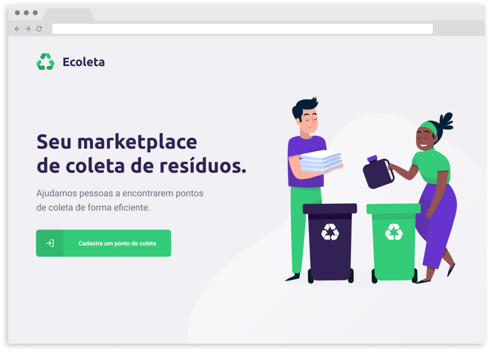
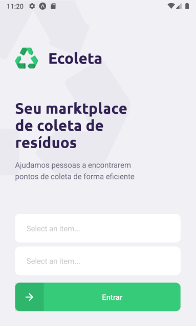
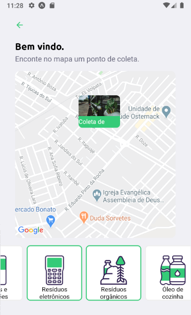
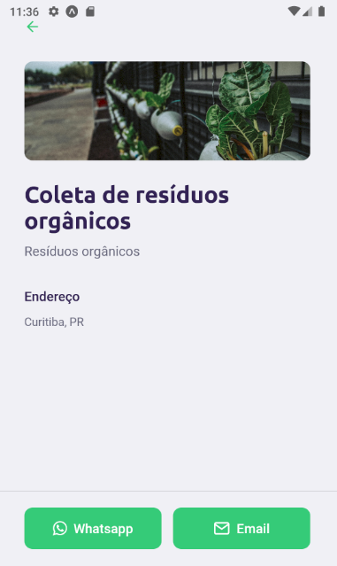

<div align="center">


</div>

## Introdução
App feito na semana Next level week, um evento da [rocketseat](https://rocketseat.com.br/) para melhor as habilidades de programação.

O ecoleta é um app mobile para localizar pontos de coleta de lixos reciclaveis, você cadastra os pontos pela versão web e pode consultar esses pontos pela versão mobile.

## Stack

- express
- react
- react-native

## Deselvolvimento
Bom sobre o desenvolvimento eu já tinha uma carga de conhecimento legal de web quando acompanhei o evento então não tive dificuldade com a parte tecnica. O que eu penei foi no ritmo frenetico para desenvolver o app porque eu não sou tão rapido como o diego e ainda tinha que meu trabalho então acabei terminando bem em cima da hora.

### React
Eu já tinha usado react antigamente mas era muito mais complicado naquela epoca e não consegui ter um aprendizado muito legal por isso fui expolorar outros framewors como o vuejs, mas hoje em dia ele me parece muito mais tranquilo e fácil de usar ele.

Não sei se é porque eu evolui bastante desde a ultima véz ou se as novas features facilitaram bastante o desenvolvimento, mas até fiquei com vontade de voltar a brincar um pouco com o react.

## Como usar

### Api

- 1 - Clone o projeto e entre na pasta server
- 2 - Instale as dependencias com ```npm install```
- 3 - Rode as migrações do projeto ```npm run knex:migrate```
- 4 - Rode as seeds do projeto com ```npm run knex:seed```
- 5 - Inicie o servidor com ```npm run dev```
- 6 - Pronto!

### Web

- 1 - Clone o projeto e entre na pasta web
- 2 - Instale as dependencias com ```npm install```
- 3 - Rodo o servidor com ```npm start```
- 4 - Pronto!

### Mobile

- 1 - Clone o projeto e entre na pasta mobile
- 2 - Instale as dependencias com ```npm install```
- 3 - Rodo o app com ```npm start```
- 4 - Escolha como você quer rodar o app usando a interface do expo
- 5 - Pronto!

### Screenshots




|  |  |  |
| -- | -- | -- |

